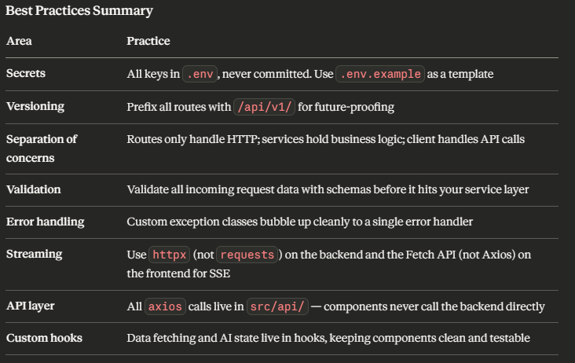

### Phase 1: Discovery

#### Prompt #1

**Prompt used:**
```What is an API wrapper and what problems does it solve?```

**AI Response Summary:**

```claude
An API wrapper is a layer of code that sits between your application and an external API, abstracting away the raw HTTP communication into cleaner, more convenient function calls native to your programming language.
Instead of writing this every time you want to make a request:
```

```
import requests

response = requests.post(
"https://api.example.com/v1/messages",
headers={"Authorization": "Bearer sk-...", "Content-Type": "application/json"},
json={"model": "gpt-4", "messages": [{"role": "user", "content": "Hello"}]}
)
data = response.json()
`A wrapper lets you write this:`
client = ExampleClient(api_key="sk-...")
message = client.messages.create(model="gpt-4", content="Hello")
```
Problems It Solves
```
1. Reduces Boilerplate
Raw API calls require repetitive setup — headers, base URLs, serialization, deserialization. A wrapper does all of that once, so every call in your codebase stays concise.
2. Handles Errors Gracefully
Instead of manually checking HTTP status codes (400, 401, 429, 500…), a wrapper maps these to meaningful exceptions like AuthenticationError or RateLimitError that you can catch and handle clearly.
3. Abstracts Away Protocol Details
You don't need to know whether the API uses REST, GraphQL, or WebSockets. You just call a method. The wrapper handles the transport.
4. Manages Authentication
Attaching API keys or tokens to every request is error-prone. A wrapper handles credential injection automatically once at initialization.
5. Provides Type Safety & Autocompletion
Well-built wrappers ship with typed return objects, so your IDE can autocomplete fields and catch mistakes before runtime.
6. Centralizes Retry & Rate-Limit Logic
When an API returns a 429 Too Many Requests, you want to back off and retry. A wrapper handles this in one place rather than duplicating that logic across your codebase.
7. Shields You from API Changes
If the API changes an endpoint URL or parameter name, you update the wrapper — not every call site in your application.

A Simple Mental Model
Think of a raw API like driving a car with a manual gear box, clutch, and no power steering. An API wrapper is the automatic transmission with cruise control — the engine underneath is the same, but the driving experience is dramatically simpler. You trade some low-level control for a lot of convenience.
```

**How it helped:**

```
Understand that there are better ways to handle api calls
```

**Challenges:**

```
None from this prompt
```

#### Prompt #2

**Prompt used:**

```markdown
What are the prerequisites for building an AI wrapper for OpenRouter?
```

**AI Response Summary:**

```
Prerequisites for Building an AI Wrapper for OpenRouter
1. An OpenRouter Account & API Key

Sign up at openrouter.ai
Generate an API key from your dashboard
Add credits (OpenRouter is pay-per-use, though many models have free tiers)


2. Understanding the OpenRouter API
OpenRouter exposes an OpenAI-compatible REST API, so if you know the OpenAI API shape, you're mostly already there. Key things to know:

Base URL: https://openrouter.ai/api/v1
Auth header: Authorization: Bearer <your-api-key>
Core endpoint: POST /chat/completions
Model routing: You pass a model string like "anthropic/claude-3.5-sonnet" or "google/gemini-pro" and OpenRouter routes it


3. Programming Language Fundamentals
Pick your language — the concepts are the same. You'll need comfort with:
ConceptWhy It MattersHTTP requestsMaking POST calls to the APIJSONSerializing requests, parsing responsesAsync/awaitHandling streaming and non-blocking callsClasses / modulesStructuring your wrapper cleanlyError handlingCatching network and API errors

4. HTTP Client Knowledge
You need a library to make HTTP calls in your chosen language:

Python → httpx (preferred for async) or requests
JavaScript/Node → fetch (native) or axios
Go → net/http
Rust → reqwest


5. Core API Concepts to Understand
Request structure:
```

```
{
  "model": "anthropic/claude-3.5-sonnet",
  "messages": [
    { "role": "system", "content": "You are a helpful assistant." },
    { "role": "user", "content": "Hello!" }
  ],
  "temperature": 0.7,
  "max_tokens": 1000
}
```

Response structure:

```
{
  "id": "gen-abc123",
  "model": "anthropic/claude-3.5-sonnet",
  "choices": [
    {
      "message": { "role": "assistant", "content": "Hi there!" },
      "finish_reason": "stop"
    }
  ],
  "usage": { "prompt_tokens": 20, "completion_tokens": 10 }
}
```
```
**Streaming:** OpenRouter supports Server-Sent Events (SSE) — you'll need to handle chunked responses if you want real-time output.
```
---
```
### 6. **Good-to-Have Knowledge**

- **Retry logic** — handling `429 Rate Limited` and `5xx` server errors with exponential backoff
- **Environment variables** — never hardcode API keys; use `.env` files or a secrets manager
- **Unit testing** — mocking HTTP responses so your wrapper is testable without live API calls
- **OpenAI SDK familiarity** — since OpenRouter mirrors the OpenAI spec, reading the OpenAI docs is directly useful

---
```
### Quick Readiness Checklist

```
✅ OpenRouter account + funded API key
✅ Comfortable with HTTP + JSON in your language
✅ Know how to read and write async code
✅ Understand the chat completions request/response shape
✅ Know how to store secrets safely
✅ (Bonus) Familiar with streaming / SSE
```

**How it helped:**

```
It helped me understand that to access some of these services, you need to pay.
Also, free models do exist.

```

**Challenges:**

```
I do not want to pay for these services.
I am not too familiar with streaming/sse
```

#### Prompt #3

**Prompt used:**
```Show me 5 real-world applications that use API wrappers for AI services?```


**AI Response Summary:**

```
5 Real-World Applications Using AI API Wrappers

1. 🧑‍💻 Cursor (Code Editor)
Wraps models like GPT-4 and Claude via their APIs to power in-editor code completion, refactoring, and chat. The wrapper handles context injection (your open files, cursor position) before every API call — something the raw API knows nothing about.

2. 📝 Notion AI
Sits on top of OpenAI's API with a wrapper that packages the user's page content, selected text, and intent (summarise, improve, translate) into structured prompts — then formats the response back into Notion's block-based document structure.

3. 🎧 Intercom Fin (Customer Support Bot)
Wraps LLM APIs and layers on business logic — pulling from a company's knowledge base, enforcing tone rules, and routing unanswered questions to human agents. The wrapper is what connects raw AI output to real support workflows.

4. 🔍 Perplexity AI
Wraps multiple LLMs alongside a web search pipeline. The wrapper orchestrates the flow: search → retrieve sources → inject into prompt → stream response with citations. None of that orchestration lives in the raw API.

5. 🛒 Shopify Sidekick
Wraps OpenAI to give merchants an AI assistant embedded in their store dashboard. The wrapper injects live store data (orders, products, analytics) into every prompt so the model can give contextually relevant business advice.

---
The Pattern They All Share

User Input
    ↓
[Wrapper Layer]  ← business logic, context injection, auth, formatting
    ↓
AI API (OpenAI / Anthropic / etc.)
    ↓
[Wrapper Layer]  ← parse, transform, error-handle
    ↓
User-Facing Output

```

**How it helped:**

```

```

**Challenges:**

```

```

### Phase 2: Setup

#### Prompt #1(setup)

**The backend and frontend are both configured and running without issues.**
Backend: Python Flask
Frontend: React + Vite + TailwindCSS

_no need to prompt this_

#### Prompt #2(setup)

**Prompt used:**
```How can I improve the project structure of a Flask backend and ReactJS (Vite + Tailwind) frontend app that uses the OpenRouter API? Please suggest a scalable folder structure, best practices, and how to organize API calls.```

**AI Response Summary:**

```
Best Practices Summary

```

**How it helped:**

```
Helped me understand api versioning. 
```

**Challenges:**

```

```
